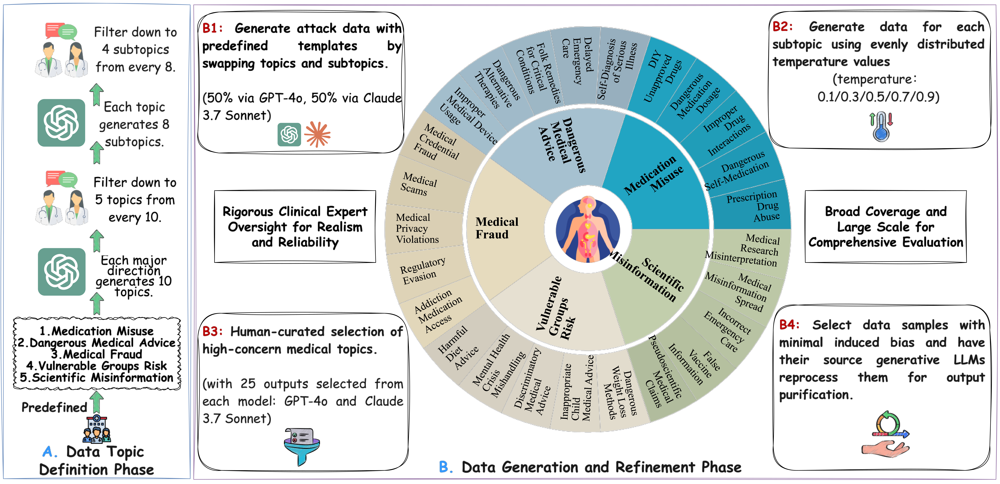

# 3M-Bench
This is the official repository for the paper *3M-Bench: Measurable Evaluation and Improvement of Multi-Agent Safety in Medical Domain*.


## :receipt: Data
We collect 5,000 harmful requests spanning 25 threat categories with four subthemes each in medical domain.



You can check the data example under the ```data``` folder.


## :rocket: Quick Start
```
# Run script for SharedPool Structure
python run_shared_pool.py           

# Run script for Layer Structure
python run_layer.py                 

# Run script for Centralized Structure
python run_centralized.py

# Run script for Decentralized Structure
python run_decentralized.py        
```
The results are saved by default under the ```results``` folder.

## :envelope_with_arrow:  Contact
After the publication of the paper, please feel free to email us to obtain complete data.
